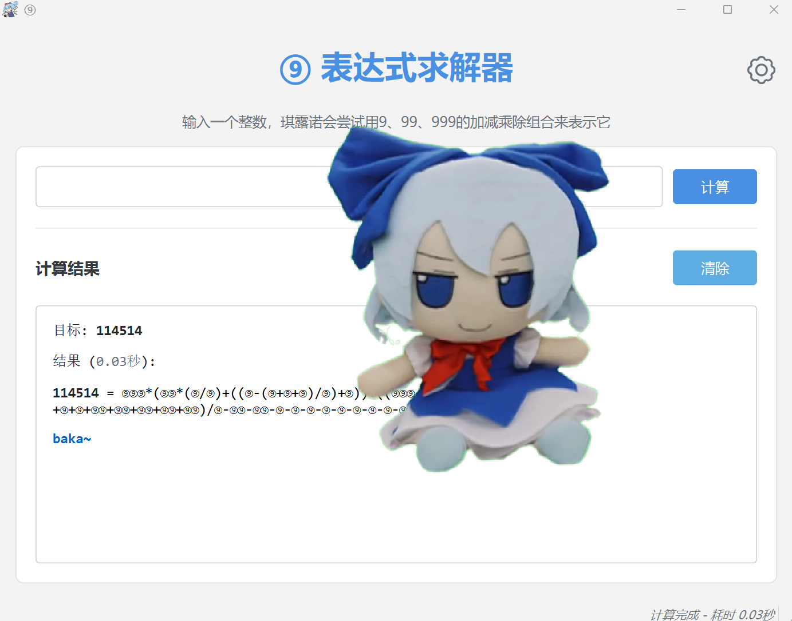
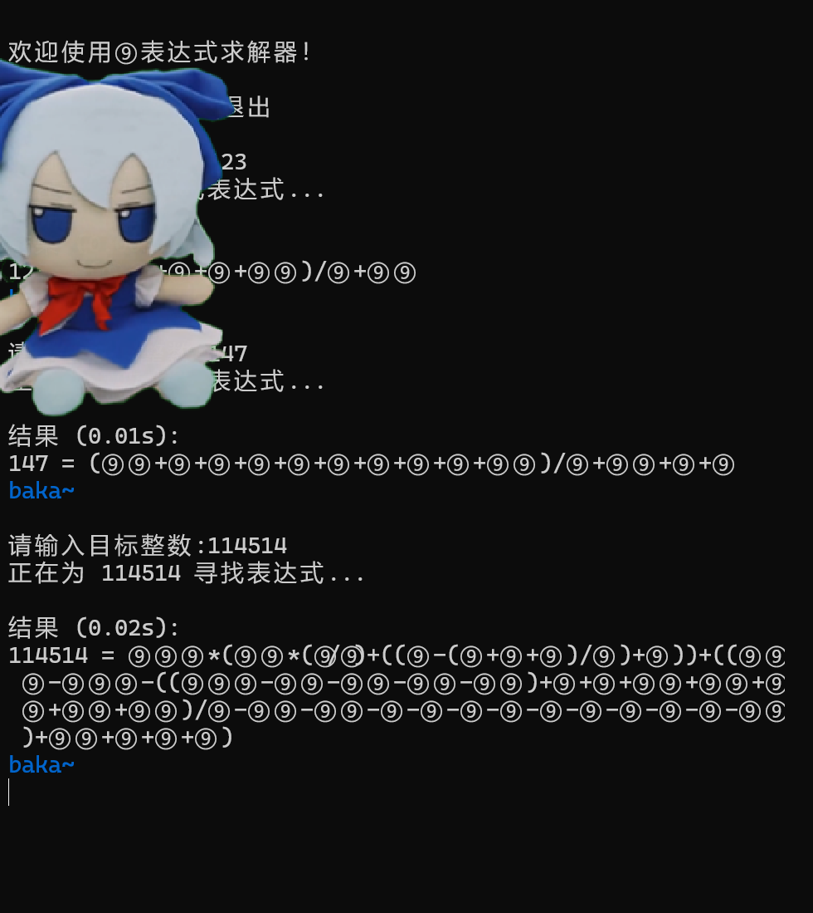

# ⑨表达式求解器 🧊

一个基于9、99、999三个基础数字，通过加减乘除运算生成目标整数的智能推理器

<picture>
  <source media="(prefers-color-scheme: dark)" srcset="./README/GUI_Dark.png">
  <source media="(prefers-color-scheme: light)" srcset="./README/GUI_Light.png">
  
</picture>



（运行截图）

## 项目简介

灵感起源

本项目灵感来源于：

1. **2025=⑨⑨⑨+⑨⑨⑨+⑨+⑨+⑨**
2. **恶臭数字论证器**：[homo数字论证器](https://lab.magiconch.com/homo/)

**实例**

```text
114514 = ⑨⑨⑨*(⑨⑨*(⑨/⑨)+((⑨-(⑨+⑨+⑨)/⑨)+⑨)
)+((⑨⑨⑨-⑨⑨⑨-((⑨⑨⑨-⑨⑨-⑨⑨-⑨⑨-⑨⑨)+⑨+⑨+⑨⑨+⑨⑨+⑨⑨+⑨⑨+⑨
⑨)/⑨-⑨⑨-⑨⑨-⑨-⑨-⑨-⑨-⑨-⑨-⑨-⑨-⑨-⑨⑨)+⑨⑨+⑨+⑨+⑨
```

## 池沼对比

| 功能   | 本项目        | Homo论证器 |
| ---- | ---------- | ------- |
| 基础数字 | 9/99/999   | 114514  |
| 运算方式 | 四则运算       | 四则运算    |
| 输出风格 | ⑨          | 恶臭化学式   |
| 音频反馈 | ⑨のbaka音效   | 无       |
| 算法目标 | 最优解搜索+大数分解 | 数字推理    |

## 程序亮点

### GUI 亮点

- **直观易用的用户界面**: 基于 PyQt6 构建，提供友好的图形界面，方便用户输入表达式和查看结果。

- **音频反馈**: 可选的音频提示功能，增强用户体验。

- **托盘图标**：方便用户找到应用

### 后端亮点

- **高效的表达式解析与计算**: 能够快速准确地处理复杂的数字

- **精确的数值计算**: 保证计算结果的高精度

- **跨平台兼容性**: 核心计算逻辑独立于平台，易于集成到不同应用中

## 版本说明

| 版本   | 路径                        | 状态  | 推荐指数  |
| ---- | ------------------------- | --- | ----- |
| 命令行版 | `Console_version/main.py` | 稳定  | ⭐⭐⭐   |
| GUI版 | `GUI_Version/gui.py`      | 开发中 | ⭐⭐⭐⭐⭐ |

## 快速开始

### 1.环境要求

- Python 3.8+
- PyQt6
- PyAudio
- 确保系统已安装音频播放所需的库（Linux: libportaudio2, macOS: portaudio）

### 2.克隆本仓库

```bash
git clone https://github.com/snow-moonlight1/9-solver
```

### 3.安装项目依赖 (推荐)

```bash
pip install -r requirements.txt
```

或者手动安装主要依赖

```bash
# Windows/macOS:
pip install PyQt6 PyAudio

# Linux:
sudo apt update
sudo apt install libportaudio2
pip install PyQt6 PyAudio
```

### 4.运行

```bash
python main.py
        or
python gui_main.py
```

**示例输入输出**

```bash
目标: 114514 
结果 (0.03秒): 
114514 = ⑨⑨⑨*(⑨⑨*(⑨/⑨)+((⑨-(⑨+⑨+⑨)/⑨)+⑨)
)+((⑨⑨⑨-⑨⑨⑨-((⑨⑨⑨-⑨⑨-⑨⑨-⑨⑨-⑨⑨)+⑨+⑨+⑨⑨+⑨⑨+⑨⑨+⑨⑨+⑨
⑨)/⑨-⑨⑨-⑨⑨-⑨-⑨-⑨-⑨-⑨-⑨-⑨-⑨-⑨-⑨⑨)+⑨⑨+⑨+⑨+⑨) 
baka~
```

## 项目结构

```bash
9solver
├── Coding/
│   └── Audio_coding.py        #音频编码
│
├── Console_version/
│   ├── audio_data.py          #音频数据
│   ├── expression_cache.py    #常用表达式缓存数据
│   ├── fumo.py                #fumo图像数据
│   └── main.py                #主入口
│
└── GUI_Version/
    ├── Icon_Data.py           #图标数据
    ├── baka_sound.py          #baka音频数据
    ├── expression_cache.py    #常用表达式缓存数据
    ├── fumo.py                #fumo图像数据
    ├── gui_main.py            #GUI主入口
    ├── main.py                #GUI后端实现
    ├── setting_green.py       #深色设置图标
    ├── setting_grey.py        #浅色设置图标
    └── widgets.py             #设置界面的按钮
```

## 注意事项

- 音频播放依赖系统解码器 

## 贡献指南

欢迎提交PR！请遵循现有代码风格：

- 使用清晰的注释
- 保持代码简洁

**~~以及大佬们带带我，我啥也不会，只会面向ai编程😭~~** 

## 许可证

   [MIT License](LICENSE)  

## 特别致谢

- [homo数字论证器(github仓库)](https://github.com/itorr/homo) 
- [Gemini](https://aistudio.google.com/prompts/new_chat)
- FinaleDreamilyNeko

## 技术指导

- Gemini

- ChatGPT

- Claude

- DeepSeek

## 相关链接

- [homo数字论证器在线版](https://lab.magiconch.com/homo/)
- [琪露诺的完美算术教室](https://www.bilibili.com/video/BV1rs41197Xn) 

##### **⑨是最强的！** 本项目的所有运算都经过⑨的严格验证，保证⑨⑨%正确！

> 提示：遇到卡顿时大喊"baka"也不会提升运算速度哦~ 
